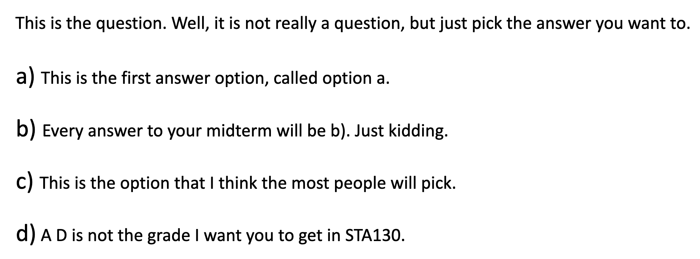

```{r, include=FALSE}
knitr::opts_chunk$set(eval=TRUE, include=TRUE, echo=TRUE, message=TRUE, warning=FALSE)
```

**This exercise worksheet is accompanied by an Quercus quiz [here](https://q.utoronto.ca/courses/239327/quizzes/271075). It is recommended that you work through this document and the quiz at the same time**.

At the end of week 3 class you chose "A", "B", "C", or "D" to the following question, which has the following translation. Assuming you don't "read" windings you probably didn't feel like there was any information by which to make your choice, which was the point of the question. 

||
|-|
||

So, does this mean that students just randomly guess between all the choices? Maybe not... let's test this assumption and perhaps reject it at some $\alpha$-significance level.

- There's a well-known effect where respondents to multi-choice questions tend prefer answer option C when they are just guessing.  So, we don't really think a NULL hypothesis of "random guessing" is correct, and we actually expect that we'll be rejecting the NULL hypothesis at an $\alpha = 0.5$ significance level. 
- So we are interested in investigating if respondents are picking answer option C a different proportion of the time than we'd expect just by chance. But to do so we are knowingly assuming a NULL hypothesis we don't really believe and we'll then do an hypothesis testing analysis that will likely allow us to reject it at an $\alpha = 0.5$ significance level. 
- This is just the usual way hypothesis testing is approached, but now we'll see if we can NULL hypothesis at an $\alpha = 0.5$ significance level based on our wingdings poll alone.

# Load the tidyverse and the data
```{r, message=FALSE}
library(tidyverse)
winding_answers = tibble(Answer=c(rep('A', 15+41),
                                  rep('B', 24+32),
                                  rep('C', 35+48),
                                  rep('D', 14+23)),
                         sesh=c(rep('Morning', 15), rep('Afternoon',41),
                                rep('Morning', 24), rep('Afternoon',32),
                                rep('Morning', 35), rep('Afternoon',48),
                                rep('Morning', 14), rep('Afternoon',23))) %>% 
  rowid_to_column()
write_csv(winding_answers, "windings_question.csv")
windings <- read_csv("windings_question.csv")
windings %>% glimpse()
```

# Question 1

What is the natural *observed test statistic* under consideration for this hypothesis testing situation?

A. The proportion of students who picked option C in our class.

B. The proportion of students who picked each option.

C. The difference between the proportion of students who picked C and the proportion who picked other options.

D. The proportion of all students like the students in our class that would pick option C in a question like this.

# Question 2

Let $p$ be proportion of students who would choose "C" under a NULL hypothesis assumption that students randomly guess in ABCD multiple choice questions, and $\hat p$ be the observed proportion of all students in our STA130 class poll who chose answer "C". What is the NULL and ALTERNATIVE hypotheses for this hypothesis testing specification?  

A. $H_0: p_{C} = 0.5$ & $H_1: H_0$ is `FALSE`

B. $H_0: \hat{p}_{C} = 0.25$ & $H_1: \hat{p}_{C} \ne 0.25$

C. $H_0: p_{C} = 0.25$ & $H_1: p_{C} \ne 0.25$

D. $H_0: \hat{p}_{C} = 0.5$ & $H_1: \hat{p}_{C} \ne 0.5$

E. $H_0= \hat{p}_{C} = 0.5$ & $H_1= \hat{p}_{C} \ne 0.5$

F. $H_0= p_{C} = 0.25$ & $H_1= p_{C} \ne 0.25$

# Question 3

Modify this code (if needed) to calculate the test statistic for this hypothesis test.

```{r}
windings %>% 
  group_by(Answer) %>% 
  summarise(n=n()) -> test_stat
test_stat
```

A. 0.1595

B. 232

C. 3/4

D. 0.3578

E. 0.35

F. 0.25

# Question 4

What value should you set `n_observations` equal to so that we can *simulate* the proportion of respondents picking C, assuming they are just picking at random? The choice needs to be appropriate for this investigation.

A. 1000

B. 232

C. 144

D. 88

\newpage

# Question 5

Which of the following would be the best code to simulate the proportion of respondents who pick C, assuming **respondents pick at random**.

Tip: Check that probabilities and the sample size are appropriate for this investigation. 

```{r, eval = FALSE}
n_observations <- NA # replace NA with you answer from part 4 above

# A
a <- sample(c("C", "Not C"), size = n_observations, replace = FALSE)

# B
b <- sample(c("C", "Not C"), size = n_observations, prob = c(0.25, 0.75), replace = TRUE)

# C
c <- sample(c("A", "B", "C", "D"), prob = c(0.5, 0.5, 0.5, 0.5),  
            size = n_observations, replace = FALSE)

# D 
d <- sample(c("C"), prob = c(0.25), size = n_observations, replace = TRUE)

```

# Question 6

Which of the following statements best describes the plot created by the code below?

A. The distribution of the proportion of respondents picking C in our class last week. 

B. The estimated sampling distribution if respondents are not choosing their answer at random.

C. The estimated sampling distribution of the proportion of respondents picking option C if the null hypothesis is true.

D. The distribution we'd expect from repeated sampling of students in our class.

```{r, echo=T, message=F}
set.seed(2022)

repetitions <- 100000
simulated_stats <- rep(NA, repetitions) 
# this vector will store the simulated proportions of respondents choosing C

for (i in 1:repetitions)
{
  new_sim <- sample(c("A", "B", "C", "D"), size=232, replace=TRUE)
  sim_p <- sum(new_sim == "C") / 232
  simulated_stats[i] <- sim_p
}
sim <- tibble(prop_C = simulated_stats)
ggplot(sim, aes(prop_C)) + 
  geom_histogram(bins=10) 
```

\newpage

# Question 7

Which of the following graphs is appropriately marked for calculating the p-value for this hypothesis test?

```{r}
base_plot <- ggplot(sim, aes(prop_C)) + 
  geom_histogram(bins=10) + 
  labs(x="Proportion of respondents picking C,\
       nassuming respondents choose an answer at random")
```

```{r}
# A
base_plot +
  geom_vline(xintercept=0.3578, color="blue") + 
  geom_vline(xintercept=0.25-(0.3578-0.25), color="red") +
  labs(title = "Plot A")
```

\newpage

```{r}
# B
base_plot +
  geom_vline(xintercept=0.3578-0.25, color="red") + 
  geom_vline(xintercept=0.25 + 0.25-(0.3578-0.25), color="blue") +
  labs(title = "Plot B")
```

\newpage

```{r}
# C
base_plot +
  geom_vline(xintercept=0.25 + abs(0.3578-0.5)/2, color="red") + 
  geom_vline(xintercept=0.25 + (0.3578-0.5)/2, color="blue") +
  labs(title = "Plot C")
```

\newpage
```{r}
# D
base_plot +
  geom_vline(xintercept=0.2, color="red") + 
  geom_vline(xintercept=0.3, color="blue") +
  labs(title = "Plot D")
```

\newpage

# Question 8

What is the p-value of this hypothesis test? Alter the following code (if needed). 

```{r}
#sim %>% 
#  filter(prop_C >= test_stat | prop_C <= 0.25-(test_stat-0.25)) %>%
#  summarise(p_value = n() / repetitions)
```

A. The p-value is below 0.0001.

B. The p-value is between 0.0001 and 0.01.

C. The p-value is between 0.01 and 0.05.

D. The p-value is between 0.05 and 0.1.

E. The p-value is above 0.1.

# Question 9

Based on the p-value computed above, we can readily determine if we reject or fail to reject the NULL hypothesis at the $alpha=0.05$ significance level.  The reason to procede so formally and rigidly is that $alpha=0.05$ is the probability of making a Type I error.  So if we proceed formally and rigidly then we have known guarantees about how like it is that we're making a Type I error. 

- To see why this is, suppose you observed a p-value exactly equal to 0.05?  What are the chances that you observe a test statistic with a smaller p-value than 0.05? The answer is 0.05, since 0.05 of the test statistics that can be observed when the NULL hypothesis is `TRUE` will have p-values smaller than 0.05. 

There is another perspective of p-values, however, which is that they indicate the "measure of evidence" against the NULL hypothesis based on the observed data, as follows.

|p-value| evidence against $H_0$|
|-|-|
|above 0.1| None |
|between 0.05 and 0.1| Weak |
|between 0.01 and 0.05 | Moderate |
|between 0.0001 and 0.01 | Strong |
|below 0.0001 | Very Strong |

Based off the p-value calculated in Question 8. What is the best interpretation of the p-value under the "measure of evidence" perspective?

A. There is 0 evidence against the null hypothesis.

B. It is impossible to get a test statistic like ours or more extreme if the null hypothesis is true.

C. We have strong evidence in favour of the alternative hypothesis. 

D. There is very strong evidence against the claim that students are picking their answers at random. 

# Question 10

It's perfectly reasonable to use the "measure of evidence" perspective rather than relying on the formal hypothesis testing procedure that provides you with the chance that you've made a Type I error; however, if you take the "measure of evidence" approach then you can't also retroactively interpret the observed p-value as providing information about the the chance that you've made a Type I error.  If you want to be very sure you're not making a Type I error, then you must set a very low $\alpha$-significance level (such as 0.0001) and perform a formal hypothesis test procedure.  The reasons for this are advanced, but are introduced [here](https://www2.stat.duke.edu/~berger/p-values.html) and presented [here](https://www.jarad.me/courses/stat587Eng/slides/Inference/I06-Pvalues/why_pvalues_dont_mean_what_you_think_they_mean.pdf), and only rely upon understanding the simulation [here](https://jaradniemi.shinyapps.io/pvalue/).

The considerations above regarding p-values are not the main problem that is encountered with p-values, however. They only clarify the counterintuitive fact that p-values are not retroactively interpretable as providing information about the the chance that you've made a Type I error.  The main problems that are encountered with p-values are when they are incorrectly interpreted as (a) the probability that the NULL hypothesis is `FALSE` or as (b) the probability the parameter of the NULL hypothesis is the hypothesized value. 

- Do NOT make the (a) and (b) errors above!  Just use the formal hypothesis testing framework to either reject or fail to reject $H_0$ at the $\alpha$-significance level which tells you the chance you've made a Type I error. Or, just use the "measure of evidence" perspective and and don't try to interpret beyond that in terms Type I error or (a) and (b) above.

Assuming we do not perform a formal hypothesis test at any specific $\alpha$-significance level, but use the "measure of evidence" perspective to interpret the meaning of the p-value of our observed test statistic, which of the following is true?

A. The p-value is the probability that the NULL hypothesis is `FALSE`.

B. The p-value is the probability that the parameter is the hypothesized value.

C. The p-value is the probability of making a Type I error

D. None of the above

# Want More Practice?

Formally state a NULL hypothesis that the rates of students choosing "C" does not differ between the morning and afternoon sections, and then carry out that hypothesis test at the $\alpha=0.05$ significance level. Do you reject or fail to reject the NULL hypothesis at the $\alpha=0.05$ significance level? Suppose you failed to reject the NULL hypothesis at the $\alpha=0.05$ significance level, can you just change the $\alpha=0.05$ significance level after the fact? Or have you now just transitioned away from the formal hypothesis testing framework and moved into the "measure of evidence" perspective?
